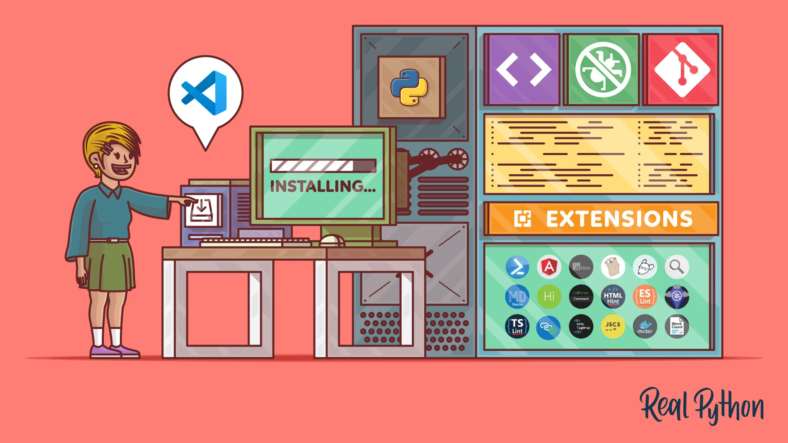

# What I learned Week-0

## Setup
Developer tools as computer setup

[Computer setup - Diagram as link](c:\Users\Meghan Carr\Desktop\Meghan - ALL til OneDrive\Python-Development-With-Studio.jpg)

Currently, I am cascading my windows to easily see these. My windows are **GitHub** in the browser, and in taskbar: **GitHub desktop** and Visual Studio Code *VS Code*.
> When I cascade, I size windows about 4/5ths the size of the screen and place them from the upper left corner of the screen. Then place the subsequent windows slightly below and to right of another window. Then a sliver of all windows is seen, no matter which is open.
I also open Slack to collaborate and ask questions of our CC community. 
> Should I also have Command Prompt *not Windows PS* open?

## Topics - Main tools for software developers, including CC, are Visual Studio Code *VSCode* and Git. Markup is a simple syntax that is good for novice coders and has other uses, such as to format content in README files. 

### GitHub and GitHub Desktop 
#### Intro to Git - Git as a magical time machine - a version control system

Git is a tool for managing code-bases. A code-base is a folder with a bunch of code files that relate to the same program/application. Tools of this nature are referred to as Version Control Systems. You will be using Git to save individual changes you make to different code files in your code-bases. 
> Is a code-base, like a database, but more specifically for code files?
A repository (or repo) in GitHub is essentially a folder for your project - stores your code, files, and the history of changes.

#### 🔑 :key: 3 Key Points for Beginner Coders/Developers:
##### **Version Control** - A repository tracks changes to your code over time, so you can return to previous versions, see who edited, and other uses. 
##### **Collaboration Hub** - Multiple people to work on the same project, so developers can suggest changes *by pull requests*, discuss them, and merge them into the main project safely. 
##### **Public or Private** - Setting the repo as public or private helps with learning, team projects, or personal work.

#### :check: GitHub and GitHub Desktop - Comparison

🔄 Similarities - Both...
- Interact with Git repositories hosted on GitHub
>Use either to manage and sync your project files between your computer and GitHub's cloud servers
- Show repository history and commits - see changes, commit messages, and contributors
- Support cloning, pushing, and pulling repositories

:arrow_double_head: Differences
| Feature - Diffs     | GitHub (Website)                                     | GitHub Desktop (App)                                      |
|---------------------|------------------------------------------------------|------------------------------------------------------------|
| **Platform**        | Web-based, works in browser                          | Installed software on your computer                        |
| **Main Purpose**    | Browsing, managing issues, pull requests, settings   | Syncing local files, committing changes, pushing/pulling   |
| **Editing Files**   | Only small edits possible in-browser                 | Used with a code editor (like VS Code) for full editing    |
| **Visualization**   | Shows network, contributors, and branches online     | Shows visual history of changes and branches locally       |
| **Usage Level**     | Good for overview and team collaboration             | Ideal for daily development tasks                          |

### VSCode is a tool for writing code files. Tools of this nature are referred to as Integrated Development Environments (IDEs). VSCode is like a fancy text editor that is designed for writing code. I appreciate the colorful clues. 

## Markdown is a syntax that adds structure and style to text documents, as ~.md. This is our first of many languages and was used to format this page. 

## Practice and Exercises

### **Blog exercise** Write and publish our first blog to a specific website. 
>How do we publish or display our blog on the CC SideQuest and/or Blog f0r the 202508 cohort?
### **Github Pages** Publish and configure Github Pages websites to fulfill the primary purpose of the internet - easy and fast distribution of information

## Self-teaching - Using ChatGPT to review a simple workflow using GitHub + GitHub Desktop + VS Code + Markdown
For a beginner-friendly step-by-step example, ChatGPT provided steps to edit a README file written in Markdown for a GitHub project.

### ✅ :check: Daily Setup - Log into GitHub Desktop with your GitHub account  *VS Code will be later.*
### 📥 :card_index: Clone a Repository from GitHub
- Go to your GitHub website to find a repository you want to work on.
- Click the green "Code" button :green_book: → copy the HTTPS URL.
- Open GitHub Desktop, then click File > Clone repository → paste the URL → choose a local folder → click Clone.
> Do we check to create a README file in these steps? Where?

### 💻 :date: Edit Files in VS Code
- In GitHub Desktop, click Open in Visual Studio Code.
- In VS Code, find a file like README.md (Markdown file).
> Shouldn't we check to create a README file, when we create it?
- Edit the file using simple Markdown, like:
># My Project Title

>This is a *simple* description written in **Markdown**.

### 💾 :notes: :mailbox_with_mail: Commit and Push Your Changes
- Save the file in VS Code.
- Switch back to GitHub Desktop:
- You’ll see your file listed as Changed.
- Add a summary like: Update README.md *and maybe 1-5 keywords* and *more details can be added to Description field*
- Click Commit to main.
- Click Push origin to upload changes to GitHub.
> Should this stepfrom below be done here or later? *Click Fetch origin (to check for updates).*

> Should changes be checked in the GitHub? If yes, desktop or Hub? 

### 🔄 :arrows_counterclockwise: Fetch or Pull Changes from GitHub
- Later, if someone else made changes, open GitHub Desktop.
- Click Fetch origin (to check for updates).
If there are updates, click Pull origin to get them into your local files.
#### Fetch vs. Pull - 2 diagrams
[FetchVsPull - Diagram 1 link](https://share.google/images/HO04f1blcbywoglnk)
[FetchVsPull - Diagram 2 link](https://share.google/images/cnqUU7A8Rl7WEI2XB)
> Beyond the remote environment, what are working directory, staging area, and local repository in the local environment?